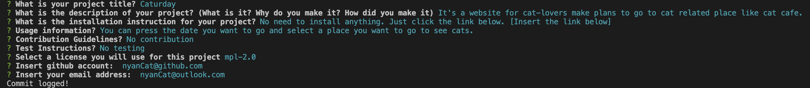

# My Github Library: ReadMe Shortcuts

## [Description](#table-of-content)
As a developer, you have devoted your time on your project to the point that you have little time to write a README file. This Professional README Generator will help you save time by using a command-line application that dynamically generates a professional README.md file from a user's input using the Inquirer package.

A professional README.md file includes:
* Title of your project
* Description
* Table of Content
* Installation
* Useage
* License
* Contribution
* Test
* Questions (Ways to reach out to you)

## Table-of-Content
* [Description](#description)
* [Usage](#usage)
* [Installation](#installation)
* [Credits](#credits)

## [Usage](#table-of-content)
The application will be invoked by using the following command:
```bash
node index.js
```
Next it will start with asking your project name. You just have to type in and press enter to move on to the next question. This also applies to most of the questions.



Once you have answer all of the questions. Check yourReadmeFolder for yourREADME.md file that you created.

## [Installation](#table-of-content)
This repo is build off of starter code [potential-enigma](https://github.com/coding-boot-camp/potential-enigma). Furthermore, this application won’t be deployed, so walkthrough video is provide in the link below.

* [Demo (Downloaded version)](./image/DemoGenerateReadmeFile.webm)
* [Quick link to demo](https://drive.google.com/file/d/144iSysHX2kvuDmazqDxnvw4ToNCBgYMV/view)

## [Credits](#table-of-content)
Without guidance from these website, my project would not exist.

* [Inquirer package](https://www.npmjs.com/package/inquirer/v/8.2.4)
* [Professional README Guide](https://coding-boot-camp.github.io/full-stack/github/professional-readme-guide) 
* [Github doc: Basic writing and formatting syntax](https://docs.github.com/en/get-started/writing-on-github/getting-started-with-writing-and-formatting-on-github/basic-writing-and-formatting-syntax)
* [Markdown table contents](https://linuxhint.com/markdown-table-contents/)
* [Fullstack Blog Video Submission Guide](https://coding-boot-camp.github.io/full-stack/computer-literacy/video-submission-guide)
* [Most Common Open Source Licenses](https://snyk.io/learn/open-source-licenses/)
* [Adding License to readme file](https://www.davidketcheson.info/2015/05/13/add_a_readme.html)
* [Choose a license](https://choosealicense.com/)
* [Find a badge](https://shields.io/)
* [Write a file with Node.js](https://nodejs.dev/en/learn/writing-files-with-nodejs/)
* [Inquirer.js Documentation](https://www.npmjs.com/package/inquirer/v/8.2.4)
* [Node js Prompts](https://cto.ai/docs/nodejs-prompts)
* [Replacing the strings](https://stackoverflow.com/questions/5865257/finding-a-substring-and-inserting-another-string)